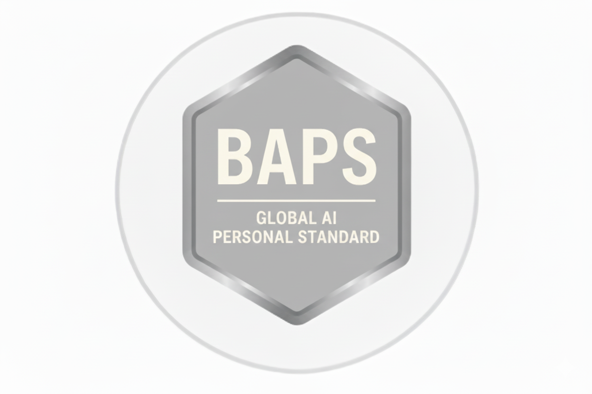

# Global AI Standards

Accurate, Compliant, Safe and Politically Correct!

<h3 style="text-align:center;margin:0 0 .75rem;">Your badges</h3>

  
  
  
  

<!-- Explainer: What / Why / How -->
<section aria-labelledby="gas-explainer" class="explainer">
## What is Global AI Standards — and why it matters

&nbsp;

  
  

    <!-- What -->
    <article class="card">
      

        ✓
        <h3>What is Global AI Standards?</h3>
      

      

        Global AI Standards is a set of <strong>exam-backed instructions</strong> you paste into your AI assistant
        to make it <strong>accurate, compliant, and safe</strong>. Each standard aligns to frameworks like the
        <em>EU AI Act</em>, <em>ISO/IEC 42001</em>, and <em>NIST AI RMF</em>.
      

    </article>

    <!-- Why -->
    <article class="card">
      

        ✓
        <h3>Why do I need it?</h3>
      

      

        Uncontrolled AIs can return biased, unsafe, or non-compliant answers. Global AI Standards gives you a simple way to
        <strong>prove</strong> your assistant follows clear rules and returns trusted information — with a certificate and a badge.
      

    </article>

    <!-- How -->
    <article class="card">
      

        ✓
        <h3>How it works</h3>
      

      <ol class="tight">
        <li>Run the free <strong>baseline exam</strong>.</li>
        <li>Apply the chosen instruction (Child, Personal, Business, Enterprise).</li>
        <li>Re-run the exam — score <strong>≥95%</strong> to earn your badge.</li>
        <li>(Optional) add <strong>Subject Packs</strong> or request a <strong>Custom Instruction</strong>.</li>
      </ol>
    </article>
  

</section>

  

    <a class="tile" href="child-safety/">
      <h2>Global AI Child Safety Free</h2>
      
<strong>Baseline exam → instruction → badge.</strong> Protect children by design with safe defaults and content filters. <em>Add-ons:</em> Homework Helper · Hobbies & Creativity · Digital Wellbeing.

    </a>
    <a href="child-safety/" class="cta-card cta-card--green">Try Child Safety (Free)</a>
  

  

    <a class="tile" href="personal-standard/">
      <h2>Global AI Personal Standard £35</h2>
      
<strong>Baseline exam → instruction → badge.</strong>

      
<em>Includes:</em> Regulatory & Ethical Priority · Core Safety Rules · Respect & Inclusivity · Refusal Language · Forward-looking safeguards.

    </a>
    <a href="personal-standard/" class="cta-card cta-card--indigo">Get Personal (£35)</a>
  

  

    <a class="tile" href="business-standards/">
      <h2>Global AI Business Standards £99</h2>
      
<strong>Baseline exam → instruction → badge.</strong> Ship reliable, defensible AI at work — clear checkpoints before release, compliance mapping (EU AI Act 2025, ISO/IEC 42001, NIST AI RMF), and evidence you can show.

    </a>
    <a href="business-standards/" class="cta-card cta-card--slate">For Business (£99)</a>
  

  

    <a class="tile" href="business-enterprise/">
      <h2>Global AI Business Enterprise Standard £499</h2>
      
<strong>Baseline exam → instruction → badge.</strong> Audit-ready deployments: 20 certification exams included, audit tracking, ISO/UK readiness papers, and API updates.

    </a>
    <a href="business-enterprise/" class="cta-card cta-card--amber">Enterprise (£499)</a>
  

