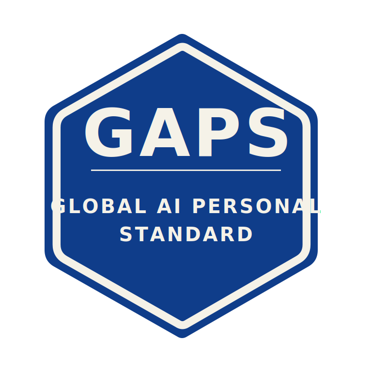

# Global AI Personal Standard

Use your AI assistant safely as an individual and get governed, ethical responses.

**Baseline exam → instruction → badge.**

## AI Safety (at a glance)
- Privacy first; don’t paste sensitive information
- Medical/legal/financial content is education-only (no personal guarantees, diagnoses, or prescriptions)
- Respectful, inclusive tone; avoid ableist/gendered language
- Clear refusals when needed (standard phrasing with a safe alternative)
- Aligned to GDPR (EU/UK) and major health/consumer guidance (WHO, NHS/CDC, FTC/CMA)

## Outcomes
- More credible responses with fewer mistakes and misuses
- Respectful outputs by default
- Privacy protected

## What you do (simple)
1. Run the **free baseline exam** on your AI assistant.
2. Purchase and copy-paste the **GAPS instruction** (£35).
3. Run the **certification exam** to get your scorecard.
4. **≥95% earns a badge.**
5. Want a higher score (including if you’re under 95%)? Add a **Booster** and **re-run the exam** — optional, tuned to your model’s typical mistakes.

---

*Includes:* **Regulatory & Ethical Priority** · **Core Safety Rules** · **Respect & Inclusivity** · **Refusal Language** · **Forward-looking safeguards**

## Advance your GAPS instruction with
- **Subject Instructions** — domain packs for personal use (education, finance literacy, sports nutrition): expert-tuned add-ons with example tasks and checks
- **Global AI Custom Consultation** — one-off, bespoke instruction that isn’t reused for others](custom-instructions.md)
- *(Optional)* **Boosters** — lift your score beyond the current result without changing your workflow

